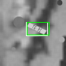
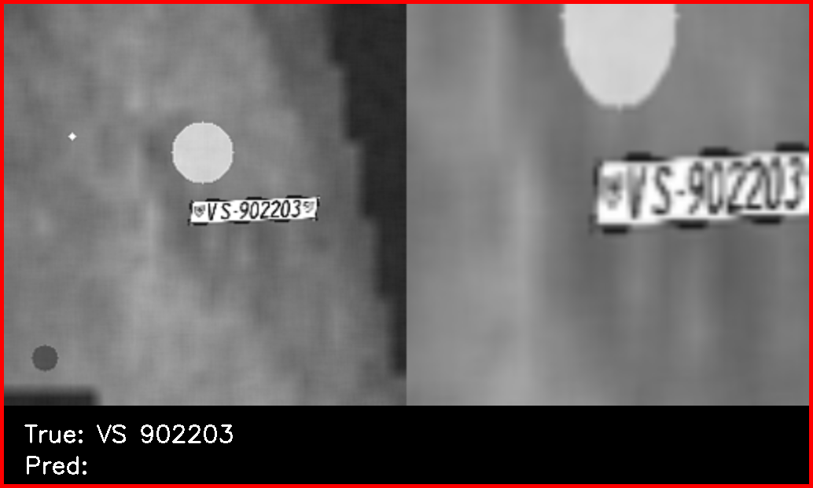
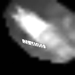
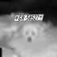
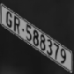
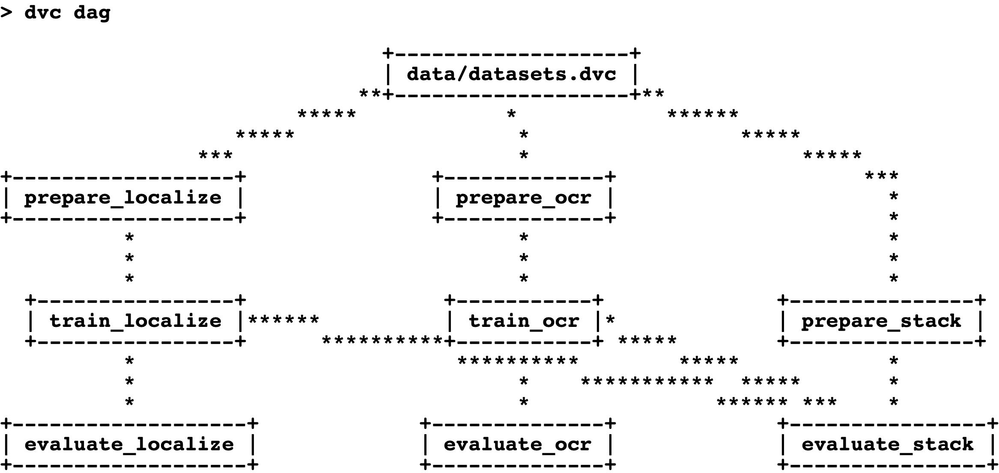

# License Plate Detection

- [License Plate Detection](#license-plate-detection)
  - [Introduction](#introduction)
  - [Results](#results)
  - [The Dataset](#the-dataset)
  - [Getting Started](#getting-started)
    - [Prerequisites](#prerequisites)
    - [Installation](#installation)
      - [Clone the repository](#clone-the-repository)
      - [Download the Dataset](#download-the-dataset)
    - [Project Structure](#project-structure)
      - [Install the Python Dependencies](#install-the-python-dependencies)
    - [Setup DVC](#setup-dvc)
      - [Reset DVC Remote](#reset-dvc-remote)
      - [Configure Your Own S3 Bucket](#configure-your-own-s3-bucket)
      - [Track with DVC](#track-with-dvc)
    - [Update the GitHub CI/CD](#update-the-github-cicd)
  - [DVC Pipeline](#dvc-pipeline)
    - [DVC Stages](#dvc-stages)
    - [Run the Pipeline](#run-the-pipeline)
    - [View the Results](#view-the-results)
      - [DVCLive](#dvclive)
      - [TensorBoard](#tensorboard)
    - [Push your Changes](#push-your-changes)
  - [DVC with CML](#dvc-with-cml)
    - [Open a Pull Request](#open-a-pull-request)
  - [Serve the Model with MLEM](#serve-the-model-with-mlem)
  - [Further Improvements](#further-improvements)
  - [Contributing](#contributing)
    - [Prerequisites](#prerequisites-1)
    - [Installation](#installation-1)
      - [Clone the repository](#clone-the-repository-1)
      - [Install the Python Dev Dependencies](#install-the-python-dev-dependencies)
      - [Install pre-commit](#install-pre-commit)
    - [Markdown Linting and Formatting](#markdown-linting-and-formatting)
  - [Resources](#resources)
    - [Implementations](#implementations)
    - [PyTorch](#pytorch)
    - [CTC Loss](#ctc-loss)
    - [Data](#data)
  - [Extra](#extra)
    - [Setup a Self-Hosted Runner with GitHub CI/CD](#setup-a-self-hosted-runner-with-github-cicd)
      - [Manual Setup](#manual-setup)
      - [With Docker](#with-docker)
        - [Build and Run the Docker image](#build-and-run-the-docker-image)
      - [With Kubernetes](#with-kubernetes)
        - [Create a secret](#create-a-secret)
        - [Create the Kubernetes Pod](#create-the-kubernetes-pod)
    - [Run the Pipeline on a Self-Hosted Runner with CI/CD](#run-the-pipeline-on-a-self-hosted-runner-with-cicd)

## Introduction

The goal of this project is to train a model to detect license plates in images using MLOps to automate the process of preparing the dataset, training the model, and deploying the model.

The approach was to train two models:

- A **localization model** to detect the license plate in the image
- An **OCR model** to detect the characters in the cropped license plate from the localization model

## Results

The first two images are the results of the individual models, localize and OCR respectively. The third image shows the result of the combination of both models to crop the image to the license plate and then run the OCR model on the cropped image.

<div style="display: flex; flex-wrap: wrap; justify-content: center; align-items: start; gap: 1rem; margin-bottom: 1rem">
  
  
  
</div>

We achieved an accuracy of around 84% for the end-to-end plate detection.

## The Dataset

The data for the models is generated on the fly using a custom Swiss license plate generator and the CIFAR-10 dataset.

The license plate generator is based on Swiss license plates. An example is shown below:


The below are some generated images for the localization model.

- The images are preprocessed to be grayscale and resized to 84x84.
- The labels are the bounding boxes `(cx, cy, w, h)` of the license plate in the image.

<div style="display: flex; justify-content: center; gap: 1rem; margin-bottom: 1rem">
  
  
  
  
  
</div>

The below are some generated images for the OCR model.

- The images are preprocessed to be grayscale, cropped and resized to 84x84.
- The labels are the characters in the license plate including the canton and the padding character. (cf. [PyTorch CTCLoss](https://pytorch.org/docs/stable/generated/torch.nn.CTCLoss.html))

<div style="display: flex; justify-content: center; gap: 1rem; margin-bottom: 1rem">
  
  
  
  
  
</div>

## Getting Started

### Prerequisites

- Python >=3.8<3.12
- Poetry >=1.3.0
- An S3 bucket to store the DVC remote

### Installation

#### Clone the repository

```sh
git clone https://github.com/leonardcser/pytorch-mlops-license-plate.git

cd pytorch-mlops-license-plate
```

#### Download the Dataset

The dataset for this project can be found under the `data` branch. You can download it using the following command:

```sh
wget https://github.com/leonardcser/pytorch-mlops-license-plate/archive/refs/heads/data.zip -O data.zip

unzip data.zip

# Move the data to the correct folder
mv pytorch-mlops-license-plate-data/datasets data/datasets

# Remove the zip and the folder
rm data.zip && rm -r pytorch-mlops-license-plate-data/
```

### Project Structure

```txt
.
├── data (1) datasets path
│   └── datasets
├── dvc.yaml
├── out (2) DVC and DVCLive outputs path
│   ├── checkpoints
│   ├── evaluations
│   ├── models
│   ├── prepared
│   └── runs
├── params.py (3) Custom parameters file in Python for DVC
├── params.yaml (4) Global parameters file for DVC
└── src (5) Source code devided into modules, one module per DVC stage
    ├── datasets
    ├── generators
    ├── localize
    ├── models
    ├── ocr
    ├── save_stack.py
    ├── serve.py
    ├── stack
    └── utils
```

#### Install the Python Dependencies

```sh
# Install the dependencies
poetry install

# Activate the virtual environment
poetry shell
```

### Setup DVC

You can use any DVC remote. In this project, we used a Google S3 bucket. If you would like to use the bucket with the cache (which includes the models), you need to get in touch with the administrator of repository to get the credentials.

#### Reset DVC Remote

First, you need to reset the DVC remote to your own S3 bucket. You can do this resetting DVC with:

```sh
dvc destroy
```

Then, you can initialize DVC with the following command:

```sh
dvc init
```

#### Configure Your Own S3 Bucket

You can simply follow the instructions on the [DVC documentation](https://dvc.org/doc/command-reference/remote/add#supported-storage-types) to setup your own S3 bucket.

> **Note:** Make sure you use the `--local` flag when configuring secrets. The configuration will be stored in the `.dvc/config` and `.dvc/config.local` files.

#### Track with DVC

For this project, you will need to track the `data/datasets` folder. You can do this by running the following command:

```sh
dvc add data/datasets
```

### Update the GitHub CI/CD

You have to also modify the GitHub CI/CD located at `.github/workflows/mlops.yml` to authenticate with your own S3 bucket. In our case, we used Google Cloud Storage.

## DVC Pipeline

In this section, you will learn how to run the pipeline.

### DVC Stages

The project is divided into 6 stages:

- `prepare_localize` - prepares the dataset for the localization model
- `train_localize` - trains the localization model
- `evaluate_localize` - evaluates the localization model
- `prepare_ocr` - prepares the dataset for the OCR model
- `train_ocr` - trains the OCR model
- `evaluate_ocr` - evaluates the OCR model
- `prepare_stack` - prepares the dataset for the combined model
- `evalutate_stack` - evaluates the combined model

You can preview the pipeline with the following command:



### Run the Pipeline

The params for DVC are separated into two files:

- `params.yaml` - global parameters
- `params.py` - stage specific parameters

The `params.py` file is a Python file that is executed by DVC. It also allows you to use the variables defined in that file with type hints for a better experience.

For testing the pipeline without needing to train the models for a long time, you can reduce the number of samples and epochs with the following command:

```sh
dvc exp run -S "params.py:MULTIPROCESSING=False" \
  -S "params.py:PrepareLocalizeParams.MAX_IMAGES=256" \
  -S "params.py:PrepareOCRParams.MAX_IMAGES=256" \
  -S "params.py:PrepareStackParams.MAX_IMAGES=256" \
  -S "params.py:TrainLocalizeParams.EPOCHS=1" \
  -S "params.py:TrainOCRParams.EPOCHS=1"
```

DVC experiments are stored automatically saved once they are run. You can list all the experiment results with the following command:

```sh
dvc exp show
```

### View the Results

#### DVCLive

While the experiment is running, you can view the live metrics with the following command:

```sh
dvc plots diff --open
```

This will open in the browser the difference between the current experiment and remote HEAD.

#### TensorBoard

To view the live training metrics, you can run the following command:

```sh
tensorboard --logdir_spec=localize:out/runs/localize/tensorboard,ocr:out/runs/ocr/tensorboard
```

### Push your Changes

Once you are satisfied with the results, you can promote the experiment to a new Git branch and push your changes:

```sh
dvc exp branch <experiment name> <branch name>
```

> **Note:** You can get the experiment name from the output of the `dvc exp run` command.

When you are satisfied with the results, you can push the changes to the DVC remote. This will also push the changes to the Git remote.

```sh
dvc push
```

## DVC with CML

### Open a Pull Request

You can open a pull request for the branch you created. GitHub will run the pipeline and CML will comment on your pull request with the differences between main and your branch.

If you are happy with the results, you can merge the pull request.

## Serve the Model with MLEM

To serve the latest model, you can run the following commands:

```sh
# Save the model stack for MLEM
python3 -m src.save_stack

# Serve the model
python3 -m src.serve
```

You can the open the browser and go to `http://localhost:80` to test the model.

## Further Improvements

Below are some ideas for further improvements:

- Add a fine-tuning stage for the localization model
- Optimize the dataset generation (this is the current bottleneck)
- Optimize the model evaluation (abstract the code)
- Train with PyTorch Lightning
- Add early stopping

## Contributing

### Prerequisites

- Python >=3.8<3.12
- Poetry >=1.3.0

### Installation

#### Clone the repository

```sh
git clone git@github.com:leonardcser/pytorch-mlops-license-plate.git

cd pytorch-mlops-license-plate
```

#### Install the Python Dev Dependencies

```sh
# Install the dependencies
poetry install

# Activate the virtual environment
poetry shell
```

#### Install pre-commit

```sh
pre-commit install
```

You can learn more about `pre-commit` [here](https://pre-commit.com/).

### Markdown Linting and Formatting

This repository uses the following VSCode:

- [`spell-right`](https://marketplace.visualstudio.com/items?itemName=ban.spellright) for spell checking markdown files.
- [`isort`](https://marketplace.visualstudio.com/items?itemName=ms-python.isort) for sorting python imports.

## Resources

### Implementations

- **Tensorflow implementation bounding box detection**

  https://pyimagesearch.com/2020/10/05/object-detection-bounding-box-regression-with-keras-tensorflow-and-deep-learning/

- **Keras - OCR model for reading Captchas**

  https://keras.io/examples/vision/captcha_ocr/

### PyTorch

- **Training with PyTorch**

  https://pytorch.org/tutorials/beginner/introyt/trainingyt.html

- **PyTorch Reproducibility**

  https://pytorch.org/docs/stable/notes/randomness.html

- **PyTorch Optimization**

  https://pytorch.org/tutorials/recipes/recipes/tuning_guide.html

- **Multi-Digit Sequence Recognition**

  https://medium.com/swlh/multi-digit-sequence-recognition-with-crnn-and-ctc-loss-using-pytorch-framework-269a7aca2a6

### CTC Loss

- **An Intuitive Explanation of Connectionist Temporal Classification**

  https://towardsdatascience.com/intuitively-understanding-connectionist-temporal-classification-3797e43a86c

- **Understanding CTC loss for speech recognition**

  https://voidful.medium.com/understanding-ctc-loss-for-speech-recognition-a16a3ef4da92

### Data

- **Inspiration dataset**

  https://www.kaggle.com/datasets/tbjorklund/annotated-synthetic-license-plates

- **Swiss number plate generator**

  https://platesmania.com/ch/informer

- **Car license plate dataset**

  https://www.kaggle.com/datasets/aslanahmedov/number-plate-detection?select=images

## Extra

### Setup a Self-Hosted Runner with GitHub CI/CD

In this section, you will learn how to run the pipeline on a self-hosted runner with GitHub Actions.

You can find below three different ways of setting up the self-hosted runner with GitHub Actions. We used the third option, as it allows us to use a GPU machine.

#### Manual Setup

To set up the self-hosted runner manually, you can use [CML](https://cml.dev). CML allows you to setup a self-hosted runner on any machine.

To use CML, you first need to install CML on the machine you would like to use as a self-hosted runner. You can find the installation instructions on the [CML documentation](https://cml.dev/doc/self-hosted-runners#install-cml-on-your-runner).

You can then run the following command to start the runner:

```sh
cml runner launch \
  --repo=<repository url>, \
  --token=<github personal access token>, \
  --labels=cml-runner-gpu, \
  --idle-timeout=never
```

> **Note:** Replace the `<repository url>` and `<github personal access token>` with the appropriate values.

#### With Docker

You can also run the CML runner in a Docker image in order to avoid installing CML, and all the dependencies, on the machine.

##### Build and Run the Docker image

```sh
docker-compose up --build
```

#### With Kubernetes

Finally, you can also run the CML runner in a Kubernetes Pod. This is the method we used in this project.

##### Create a secret

```sh
echo -n "Enter the personal access token: " &&
  read -s ACCESS_TOKEN && \
    kubectl create secret generic gh-pat-secret --from-literal=personal_access_token=$ACCESS_TOKEN
  unset ACCESS_TOKEN
```

This command does the following:

- Uses the `read` command to read the personal access token from the terminal so that it is not stored in the shell history.
- Uses the `kubectl create secret` command to create a secret named `gh-pat-secret` with the personal access token.
- Uses the `unset` command to unset the `ACCESS_TOKEN` environment variable.

> **Note:** Replace `<personal access token>` with your GitHub personal access token.

##### Create the Kubernetes Pod

```sh
kubectl apply -f kubernetes/cml-runner.yml
```

This command create a Kubernetes Pod named `cml-runner` with the label `cml-runner-gpu`.

### Run the Pipeline on a Self-Hosted Runner with CI/CD

Now that you have a self-hosted runner, you can run the pipeline on it.

The workflow is the following:

- You make changes to `params.py`
- You commit the changes
- You push the changes to GitHub
- CML detects the changes
- DVC runs the pipeline
- CML creates a comment on the commit with the results
